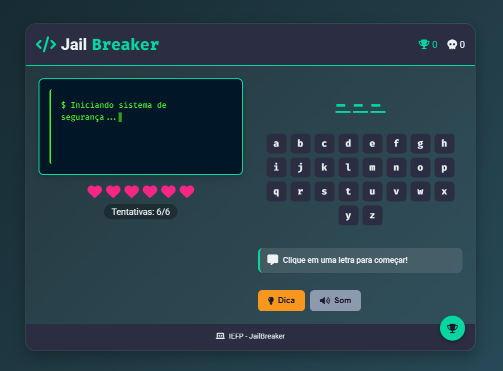

# 💻 Projeto JailBreaker

Este projeto foi desenvolvido no âmbito do curso **Técnico Especialista de Gestão e Programação de Sistemas Informáticos** – 2º ano, como parte da apresentação na **Feira das Profissões** na **Feira de Leiria** 🎓✨

## 🎯 Objetivo

O objetivo deste trabalho foi colocar em prática os conhecimentos adquiridos ao longo do curso, através do desenvolvimento de uma aplicação web interativa e funcional.  
Utilizámos tecnologias como:

- 🌐 **HTML** – Estrutura da página  
- 🎨 **CSS** – Estilo e design  
- ⚙️ **JavaScript** – Funcionalidades e lógica  

Tudo isto para criar uma experiência envolvente e didática! 😊

## 📁 Estrutura do Projeto

```
📂 jailbreaker_game
├── index.html  🔹 Estrutura da interface
├── script.js   🔸 Comportamento e interatividade
└── css.js      🔸 Estilos e design
```

## 🧠 O que vais encontrar

- Uma página web dinâmica
- Funcionalidades desenvolvidas com JavaScript (sem nested loops! 😉)
- Interface simples e eficaz, pronta para demonstrar o que aprendemos!

## 🎮 Demo

<p align="center">
  
</p>

**Acesso:** [JailBreaker Game Demo](https://julyduds.github.io/jailbreaker_game/)

📍 Este projeto foi apresentado na **Feira de Leiria**, com o propósito de mostrar o talento e as competências dos alunos do curso de **Técnico Especialista de Tecnologias e Programação de Sistemas de Informação**. Foi uma oportunidade incrível para partilhar conhecimento com o público e com outros colegas da área! 🙌

## 👤 Créditos

Trabalho realizado por:
- [Juliana Alves](https://github.com/JulyDuds)
- [Babi Sobrinho](https://github.com/babisobrinho)
- [Lenice Soares](https://github.com/lenicesoaares)
- [Rebeca Santos](https://github.com/RebecaSantosb)
- [Aline Armando](https://github.com/kiamy6)
- [Thalyson Santos](https://github.com/taysoic)
- [Diogo Simão](https://github.com/ritmico1)

📚 IEFP Leiria
🛠️ Desenvolvido com dedicação, criatividade e paixão pela tecnologia! ❤️‍🔥
